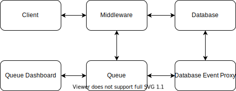

# Approach for a post-prototype application

This document describes a possible architecture that could be fitting for
maturing the product after a successful prototype phase.

The technologies used are opinionated and based on the experience of the author.

## Project Architecture

To enable rapid development, code reusability, compatibility of components and low likelihood of conflicts,
the project shall be organized as a monorepo. A feasible tool is [lerna](https://github.com/lerna/lerna),
which is also used [in this prototype project](../../lerna.json).

In the monorepo, each of the components illustrated in the image above would be a single package.

The individual packages are described in more detail below.

### Client

| Topic     | Decision                             | Notes / Reason                                                                                                                                                                                                                                                                                  |
| --------- | ------------------------------------ | ----------------------------------------------------------------------------------------------------------------------------------------------------------------------------------------------------------------------------------------------------------------------------------------------- |
| Framework | [Angular](https://angular.io/)       | Alternative frontend frameworks such as React or Vue can be considered based on the dominating technology in the company or based on developer experience.                                                                                                                                      |
| Security  | non-critical                         | The frontend must not contain critical implementation details that control data integrity or access restrictions. These should be part of the database layer. However, it should of course represent those rules and for example present different views to admins as opposed to regular users. |
| Hosting   | [Kubernetes](https://kubernetes.io/) | Industry Standard, config-as-code, great developer experience                                                                                                                                                                                                                                   |

### Middleware

| Topic     | Decision                                                                   | Notes / Reason                                                                                                                                 |
| --------- | -------------------------------------------------------------------------- | ---------------------------------------------------------------------------------------------------------------------------------------------- |
| Platform  | [NodeJS](https://nodejs.org/)                                              | (see below)                                                                                                                                    |
| Language  | [Typescript](https://www.typescriptlang.org/)                              | Code-sharing capabilities with the frontend.                                                                                                   |
| Framework | [NestJS](https://nestjs.com/)                                              | Similar architectural decisions and concepts as in Angular.                                                                                    |
| API       | [GraphQL](https://graphql.org/), [Postgraphile](https://www.graphile.org/) | Advantageous over REST, great tooling and integration with the stack. Postgraphile is used in this layer to expose the database to clients. |
| Hosting   | [Kubernetes](https://kubernetes.io/)                                       | Industry Standard, config-as-code, great developer experience                                                                                  |

### Database

| Topic      | Decision                                                                                                     | Notes / Reason                                                                                                                                                                                                  |
| ---------- | ------------------------------------------------------------------------------------------------------------ | --------------------------------------------------------------------------------------------------------------------------------------------------------------------------------------------------------------- |
| Technology | [PostgreSQL](https://www.postgresql.org/)                                                                    | High adoption, Documentation                                                                                                                                                                                    |
| Migrations | [graphile-migrate](https://github.com/graphile/migrate)                                                      | Part of the Postgraphile ecosystem                                                                                                                                                                              |
| Schema     | [Postgraphile](https://www.graphile.org/), [GraphQL Code Generator](https://www.graphql-code-generator.com/) | Generation of `.graphql` and `.ts` schemas for consumption in other parts of the application                                                                                                                    |
| Hosting    | PaaS                                                                                                         | Depending on the cloud provider, for example [Google Cloud SQL](https://cloud.google.com/sql/docs/postgres/quickstart), [Azure Database for PostgreSQL](https://azure.microsoft.com/de-de/services/postgresql/) |

### Queue

The task queue is used to enable an event based and more resilient architecture of the application.

Events such as user interaction, database changes or time based triggers can create tasks whcih are then
consumed and worked on by [workers](https://docs.bullmq.io/guide/workers).

| Topic          | Decision                                        | Notes / Reason                                                                               |
| -------------- | ----------------------------------------------- | -------------------------------------------------------------------------------------------- |
| Infrastructure | [redis](https://redis.io/)                      | Can also be re-used for other purposes of the app (e.g. storing "recent items", "favorites") |
| Technology     | [bullmq](https://github.com/taskforcesh/bullmq) | Typescript Native                                                                            |
| Hosting        | [Kubernetes](https://kubernetes.io/) or PaaS    | Depending on the business environment, an instance might already be available                |

### Queue Dashboard

Visibility into the queue and administering of the tasks (investigating failures,
restarting, ...).

| Topic      | Decision                                              | Notes / Reason                                                |
| ---------- | ----------------------------------------------------- | ------------------------------------------------------------- |
| Technology | [bee-queue/arena](https://github.com/bee-queue/arena) | Built for `bullmq`                                            |
| Hosting    | [Kubernetes](https://kubernetes.io/)                  | Industry Standard, config-as-code, great developer experience |

### Database Event Proxy

The database event proxy acts as a bridge between the concept of database events in
[graphile/worker](https://github.com/graphile/worker) and the task queue used by other
parts of the application.

An example of exporting `graphile-worker` events to a `bullmq` queue can be found
[here](https://github.com/graphile/worker/tree/main/examples/worker-bullmq-exporter).

| Topic     | Decision                                              | Notes / Reason                 |
| --------- | ----------------------------------------------------- | ------------------------------ |
| Framework | [graphile/worker](https://github.com/graphile/worker) | Part of the Graphile ecosystem |
