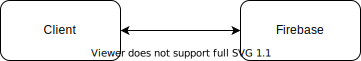

# Prototype Architecture

The following diagram illustrates the architecture of the prototype:

## Client

The client is implemented as an Angular app. It uses popular libraries from the ecosystem
to implement design and functionality with minimal efforts:

- Layout: [Bootstrap](https://getbootstrap.com)
- Design/Components: [Angular Material](https://material.angular.io)
- Firebase Connectivity: [Angular Fire](https://github.com/angular/angularfire)

## Firebase

This prototype uses [Google Firebase](https://firebase.google.com/) to provide a solution in
the following areas:

- Auth / User Management: [Firebase Auth](https://firebase.google.com/products/auth)
- Database / Document Storage: [Firestore](https://firebase.google.com/products/firestore)

Other Firebase services are currently not used, but could be beneficial as well:

- [Hosting](https://firebase.google.com/products/hosting)
  (As a replacement for the current "old-school" ftp/webspace hosting)
- [Storage](https://firebase.google.com/products/storage)
  (For storing reports, attachments, etc.)
- [Functions](https://firebase.google.com/products/functions)
  (Background Tasks / Computation without server requirements)
- ...

The related Firebase Project is
[fsp-demo-app](https://console.firebase.google.com/u/0/project/fsp-demo-app).

## Approach

Firebase offers flexible products and they might be used and combined in different ways to
achieve developer goals. This prototype app uses the following approaches:

### Store flat objects

All firestore objects are "flat" and contain
[references](https://firebase.google.com/docs/reference/js/firebase.firestore.DocumentReference)
to other objects. For example, here an `event` object can be seen with references
to `clinic` and `employee`:

