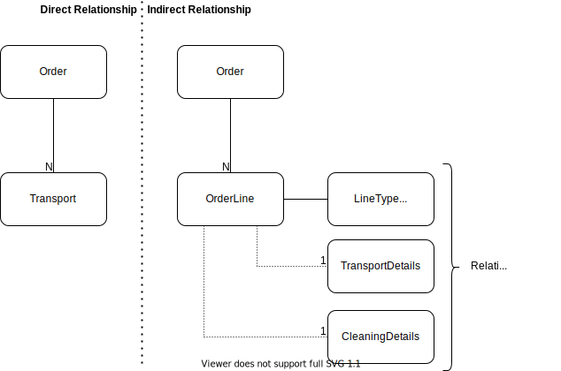

# Concept Creation

This document describes my approach to creating application concepts and architectures
as well as the "paradigms" that proved as valuable based on my personal experience.

## Database as the leading system

Relational Databases are powerful systems for defining all rules and relations about the data
that is handled in an application.

In early projects, I often made the mistake to define critical business rules such as data validation
or access restrictions on the application level while it could have been defined directly in the
database.

Defining those critical rules not on the database layer has at least two risks:

- The data and its integrity are dependent on an application that is not controlled
  by the database (the place where data is stored). This introduces a critical relationship
  between systems that could otherwise coexist and be loosely coupled.
- Direct modifications in the database can lead to inconsistencies which would have been caught
  in the application layer

I since focus on a robust and extensible datamodel and treat the database as the core of the application.
My thinking and approach is heavily influenced by [Postgraphile](https://www.graphile.org/postgraphile/postgresql-schema-design/) which is also a core component of the architecture described
[in this project](./architecture/post-prototype.md).

Although this approach might seem contraproductive in the context of prototyping, I find that the
overhead is quite small and a bit more initial effort to create tooling and a robust initial schema
quickly pay off as the app (and/or team) grows.

## Think about edge cases

In the conversation with clients and business representatives I observed in almost all projects that
it is key to ask the right questions and to dig deeper into the application design. The first thing
I usually do in a project before writing any code is therefore a draft of the involved entities and
processes.

Based on an initial call or requirements description, I prepare such draft for myself
before approaching the client for a longer conversation and "deep dive" into the planned application
and processes. During this step, it is possible to define a robust data model that can not only
cover the initial requirements but that also has future extensions in mind.

For example in a recent project, the client approached us to create an application that handles
the planning and disposition of logistics tours. While the initial requirements were only about
a B2B process and a single product (the transport service), we discovered in the meeting that
certain business extensions are planned in the foreseeable future and that other customer types
and more services must be handled.

While planning, offering and implementing the original requirements would be perfectly possible,
we were able to identify and eliminate potential architectural limitations before even starting.
These issues would have come up eventually and significantly affected the complexity, quality
and cost of the product.

Especially in the process of prototyping, these considerations must not all be implemented in the first
place. But in most cases, the technical overhead of such architectural change is small in the beginning
of a project, but can be a huge challenge later in the project, especially with data already
in the system. The following schema illustrates this kind of change.

## Relationships and Dependencies

An application should be architected in a way to require as little maintenance as possible
and that administrators and developers have a pleasent experience when extending the software,
deploying new versions or having to take down some parts during maintenance.

Almost always this means that unwanted data modifications such as data loss, duplications or
incomplete/inconsistent modifications must be avoided.

The ability to do so easily is directly dependent on the way the application was structured.
In the previous section I already explained the database as the leading system for the long
term data of the application.

Another important aspect is "in-process" data or "application state". In the scenario
described in [the architecture description](./architecture/post-prototype.md) this
applies to tasks in the queue as well as currently running tasks in a worker process.

The queue not only enables the app to decouple a single user/request from an action,
it also brings the ability to retry failed/aborted tasks and to make sure the state is
consistent. For example, if the worker process is shut down during an update while a task
is being performed, it will fail/get stalled. The task has to be designed in a way to be
safely retried later. The keyword is [idempotence](https://en.wikipedia.org/wiki/Idempotence).
